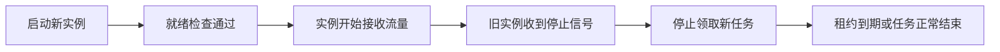
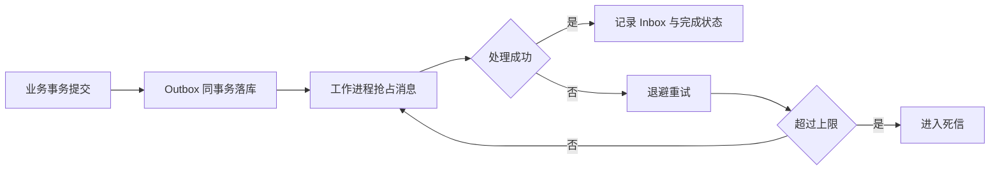

# 生产可靠性底座 - 功能分析

## 概述

本功能把 MiniAdmin 从“单实例可运行”提升为“单机或多实例生产部署可恢复”：定时任务不会因多实例而并发重复执行，关键事件不会因进程重启而丢失，健康检查能反映真实依赖状态，部署前能阻止危险配置，数据可以完成可验证的备份与恢复。

## 一、交互链

### 场景 1：运维滚动发布

**用户故事**：作为运维人员，我想在不中断业务的情况下重启或扩容 API，以便安全发布版本。

### 场景 2：事件投递失败恢复

**用户故事**：作为运维人员，我想让提交成功的业务事件自动重试，以便短暂故障不会造成通知或后续处理永久丢失。

### 场景 3：备份与恢复

**用户故事**：作为系统管理员，我想一条命令备份数据库和上传文件，并能校验后恢复，以便误操作或服务器故障后可恢复服务。

## 二、逻辑树

### 事件流

| 时刻 | 事件 | 处理 | 产生的新事件 |
|---|---|---|---|
| T1 | 定时任务到期 | 使用条件更新抢占数据库租约 | 获得唯一执行令牌 |
| T2 | 任务执行中 | 周期续租；实例停止时停止领取 | 完成、失败或租约超时 |
| T3 | 业务事务保存 | Outbox 消息与业务数据同事务提交 | 待投递消息 |
| T4 | Outbox 扫描 | 抢占消息并按处理器检查 Inbox | 成功、重试或死信 |
| T5 | 健康探测 | 检查进程、数据库和主缓存 | liveness/readiness 结果 |

### 状态流转

| 实体 | 触发事件 | 前状态 | 后状态 |
|---|---|---|---|
| ScheduledJob | 抢占成功 | Due | Running/Leased |
| ScheduledJob | 正常完成 | Running/Leased | Scheduled |
| ScheduledJob | 实例失联 | Running/Leased | LeaseExpired -> Due |
| OutboxMessage | 抢占成功 | Pending/Retry | Processing |
| OutboxMessage | 处理成功 | Processing | Succeeded |
| OutboxMessage | 可重试失败 | Processing | Retry |
| OutboxMessage | 超过重试上限 | Processing | DeadLetter |
| InboxMessage | 处理器提交 | 不存在 | Processed |

## 三、功能编号与网络定位

| 编号 | 功能节点 | 层级 | 简介 |
|---|---|---|---|
| I-PR-01 | 分布式任务租约 | 基础设施 | 多实例任务互斥、续租与超时接管 |
| I-PR-02 | 事务 Outbox/Inbox | 基础设施 | 可靠、至少一次、可幂等的事件投递 |
| I-PR-03 | 生产健康与配置门禁 | 基础设施 | 真实就绪检查和危险配置阻断 |
| I-PR-04 | 备份恢复 | 基础设施 | 数据库、文件、配置清单的灾备闭环 |

### 前置依赖

| 依赖节点 | 依赖方式 | 是否已有 |
|---|---|---|
| EF Core 工作单元 | 同事务写入 Outbox | 是 |
| 本地事件总线 | Outbox 消费后调用处理器 | 是 |
| 定时任务中心 | 增加租约协议 | 是 |
| Docker Compose | 执行备份、恢复与健康探测 | 是 |

### 边界接口

| 接口/协议 | 定义方 | 消费方 | 敏感度 |
|---|---|---|---|
| `IUnitOfWork.AddOutboxEvent` | Application.Contracts | 业务应用服务 | 高 |
| `IScheduledJobRepository` 租约接口 | Application.Contracts | 定时任务应用服务 | 高 |
| `/health/live`、`/health/ready` | API | Docker/负载均衡 | 高 |
| 备份目录清单与校验和 | 运维脚本 | 恢复脚本 | 高 |

## 四、结论

- 先完成数据库模型和租约，再实现 Outbox/Inbox，最后接入健康检查与运维脚本。
- 投递语义为至少一次；框架通过 Inbox 保证同一消息与同一处理器只提交一次数据库结果。
- 外部 HTTP、邮件等不可事务化副作用仍应携带消息 ID，由下游做幂等。
- 本版本不引入 Kafka、RabbitMQ、Kubernetes 或跨地域多活。
