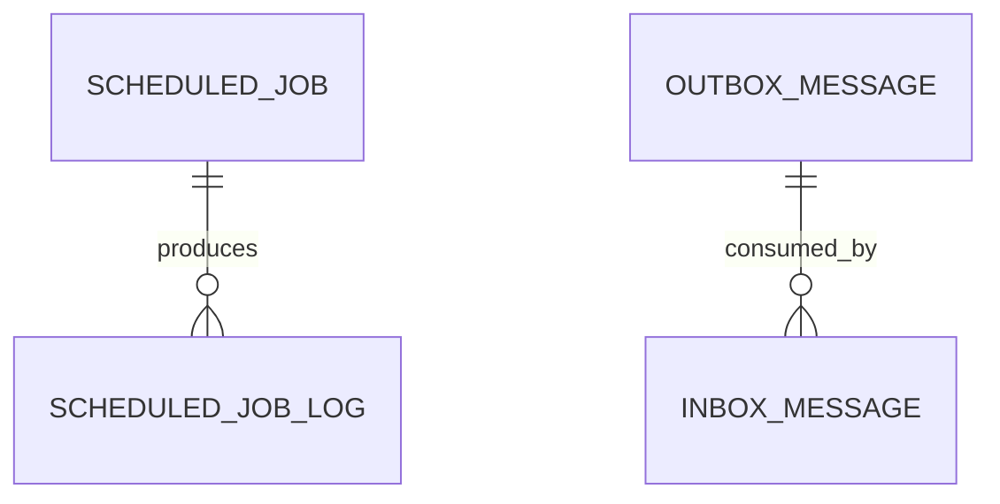
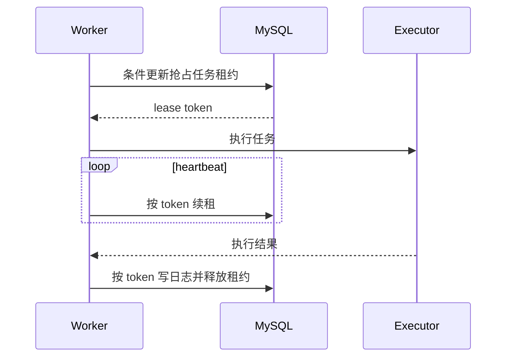
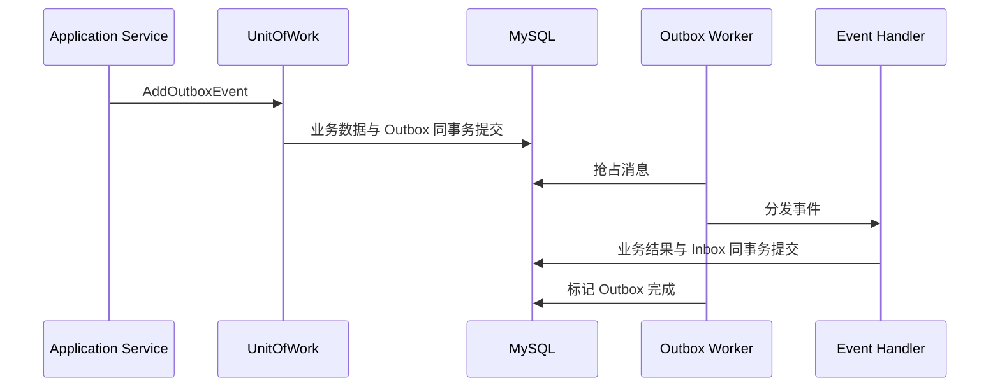

# 生产可靠性底座 - 服务端设计报告

> 关联设计：[事件总线与工作单元](../../../../2026-06-09-event-bus-unit-of-work/01-requirements.md)

## 1. 目标

- 定时任务支持数据库租约、心跳续租、超时接管和安全释放。
- 工作单元支持事务 Outbox，后台工作进程支持重试、死信和 Inbox 幂等。
- 提供独立的存活与就绪探针，数据库或主缓存异常时返回真实状态。
- 生产启动时阻止弱密钥、内存数据库和占位配置。
- 数据库初始化在多实例启动时使用 MySQL advisory lock 串行执行。
- 提供可校验的一键备份、恢复和保留策略。

## 2. 现状分析

- `ScheduledJobWorker` 每 30 秒查询到期任务，多个实例会同时读到并执行同一任务。
- `EfUnitOfWork` 在事务提交后直接调用内存事件总线，提交与投递之间存在崩溃丢失窗口。
- `/health` 只返回固定 Healthy，无法发现数据库或 Redis 故障。
- Docker 已有容器健康检查、日志轮转和持久卷，但没有业务数据备份/恢复脚本。

## 3. 数据模型与接口

### 数据模型

`mini_scheduled_jobs` 新增：`lease_token`、`lease_owner`、`lease_expires_at`、`last_heartbeat_at`。

`mini_outbox_messages` 保存事件类型、JSON 负载、状态、重试次数、下次执行时间、租约和错误信息。

`mini_inbox_messages` 使用 `(message_id, consumer_name)` 唯一键记录处理器已提交结果。



### 接口契约

- `POST /system/outbox-message/{id}/retry`：将死信或失败消息重新置为待处理。
- `GET /system/outbox-message/list`：分页查看待处理、重试和死信消息。
- `GET /health/live`：仅检查进程是否存活。
- `GET /health/ready`：检查数据库和主缓存是否可用。
- `GET /health`：兼容入口，等同 readiness。

## 4. 核心流程





## 5. 项目结构与技术决策

```text
Application.Contracts/Events/       可靠事件与运维契约
Domain/Entities/                    OutboxMessage、InboxMessage、任务租约字段
Infrastructure/Events/             序列化、仓储、分发器、后台 worker
Infrastructure/ScheduledJobs/      worker identity 与租约配置
Api/Health/                         生产配置校验和健康检查
scripts/                            backup/restore/acceptance 脚本
.github/workflows/ci.yml            部署契约、迁移 SQL 与镜像构建门禁
```

| 决策 | 方案 | 理由 |
|---|---|---|
| 消息存储 | 复用业务 MySQL | 与业务事务原子提交，不增加部署依赖 |
| 投递语义 | 至少一次 + Inbox | 能从崩溃恢复，处理器可实现幂等 |
| 任务互斥 | 数据库条件更新租约 | 跨实例安全，失联后可自动接管 |
| 健康检查 | liveness/readiness 分离 | 避免依赖故障导致无意义重启循环 |
| 外部依赖 | 不新增 | 降低部署和维护复杂度 |

## 6. 验收标准

| 验收条件 | 验收方式 |
|---|---|
| 两个 worker 不能同时获得同一任务 | 仓储并发测试 |
| 租约到期后其他实例可接管 | 单元测试 |
| Outbox 与业务保存原子提交 | 工作单元测试 |
| 消息失败自动退避并最终死信 | 处理器测试 |
| 同一处理器不会重复提交 | Inbox 唯一性与重试测试 |
| 数据库故障时 readiness 非 200 | API 集成测试 |
| 生产弱密钥启动失败 | 配置校验测试 |
| 备份包含 SQL、上传文件、清单和 SHA256 | 脚本静态检查与演练文档 |
| 部署配置与镜像可以重复构建 | CI Compose 契约、迁移 SQL 和镜像构建 |
| 现有功能无回归 | 后端全量测试、前端构建、文档构建 |

## 7. 暂不实现

| 功能 | 理由 |
|---|---|
| Kafka/RabbitMQ | 当前单体和轻量微服务演进不需要额外中间件 |
| Exactly-once 宣称 | 外部副作用无法由本地数据库提供绝对 exactly-once |
| Kubernetes Operator | 当前部署目标仍以 Docker Compose/1Panel 为主 |
| 跨地域自动容灾 | 成本和复杂度远高于当前项目收益 |
