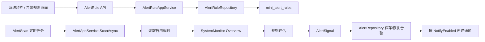

# 告警规则配置设计

## 背景

当前系统已经具备系统监控看板、告警中心、通知中心和告警扫描定时任务。现有告警扫描逻辑集中在 `AlertAppService`，内存阈值、失败任务、失败审计日志、异常文件等判断条件是硬编码的。

企业级后台需要管理员能够调整告警策略，例如临时关闭某类告警、根据线上机器规格调整内存阈值、控制是否通知管理员。第一版不做任意表达式规则引擎，而是将系统内置告警规则做成可配置能力，并在数据模型上预留后续扩展空间。

## 设计目标

- 支持系统内置告警规则的查询、编辑、启用和停用。
- 告警扫描不再依赖硬编码阈值，而是读取启用的规则配置。
- 支持配置告警级别、阈值、统计窗口、通知开关、排序和备注。
- 告警规则归入 `系统监控 / 告警规则` 菜单，并受 RBAC 权限控制。
- 保持现有告警中心、通知中心的数据流不变，降低改动风险。

## 不做范围

- 不开放管理员自定义任意表达式。
- 不开放删除系统内置规则，第一版使用启用/停用代替删除。
- 不做短信、邮件、Webhook 等外部通知渠道。
- 不做按租户、部门、用户维度的差异化告警策略。

## 规则范围

第一版内置 5 类规则：

| 编码 | 名称 | 指标来源 | 阈值含义 |
| --- | --- | --- | --- |
| `MemoryHigh` | 内存使用率过高 | 系统监控内存快照 | 使用率百分比 |
| `DependencyUnhealthy` | 依赖异常 | 系统监控依赖检查 | 是否存在异常依赖 |
| `ScheduledJobFailed` | 定时任务失败 | 近 N 小时任务日志 | 失败数量 |
| `AuditFailureHigh` | 操作失败日志过多 | 近 N 小时审计日志 | 失败数量 |
| `AbnormalFileDetected` | 异常文件数量过多 | 文件记录状态 | 异常数量 |

## 数据模型

新增实体 `AlertRule`，对应表 `mini_alert_rules`。

建议字段：

- `Id`
- `Code`
- `Name`
- `Description`
- `Metric`
- `Operator`
- `Threshold`
- `WindowMinutes`
- `Level`
- `Enabled`
- `NotifyEnabled`
- `Sort`
- `Remark`
- `CreatedAt`
- `UpdatedAt`

其中 `Metric`、`Operator`、`Threshold` 是后续扩展规则引擎的基础字段。第一版由后端根据 `Code` 选择固定评估器，不让前端自由拼复杂表达式。

## 后端架构

新增契约：

- `AlertRuleDto`
- `AlertRuleListQuery`
- `UpdateAlertRuleRequest`
- `IAlertRuleAppService`
- `IAlertRuleRepository`

新增应用服务：

- `AlertRuleAppService`

调整告警扫描：

- `AlertAppService.ScanAsync` 读取启用规则。
- 根据规则 `Code` 和系统监控 `Overview` 生成 `AlertSignal`。
- 规则关闭时不生成对应告警信号。
- `NotifyEnabled=false` 时，告警仍进入告警中心，但不进入通知中心。

为控制职责，规则评估逻辑可以拆为内部方法或独立服务。第一版优先保持文件数量适中，如果 `AlertAppService` 继续膨胀，再拆出 `AlertRuleEvaluator`。

## 前端设计

新增页面：

`frontend/vue-vben-admin/apps/web-antd/src/views/system/alert-rule/index.vue`

页面能力：

- 规则列表。
- 按启用状态、告警级别、关键词筛选。
- 编辑规则。
- 快速启用/停用。
- 快速开启/关闭通知。

编辑内容：

- 告警级别。
- 阈值。
- 统计窗口。
- 启用状态。
- 通知开关。
- 备注。

内置规则的编码、名称、指标来源不允许编辑。

## 权限设计

新增菜单：

- 父级：`SystemMonitor`
- 菜单：`AlertRule`
- 路径：`/system/alert-rule`
- 组件：`/system/alert-rule/index`

新增权限：

- `system:alert-rule:query`
- `system:alert-rule:update`

第一版不添加创建和删除权限。

## 数据流转

## 错误处理

- 更新不存在的规则返回 `404`。
- 阈值小于 0、统计窗口小于 1 分钟返回业务错误。
- 不支持的规则编码不参与扫描，避免异常中断全部告警扫描。
- 告警扫描出现单条规则评估异常时，应记录为任务失败日志，由定时任务日志承接排查。

## 测试策略

后端测试覆盖：

- 初始化种子数据生成 5 条默认告警规则。
- 菜单返回 `SystemMonitor > AlertRule`。
- 无权限用户不能访问规则接口。
- 关闭 `AbnormalFileDetected` 后，异常文件不再产生告警。
- 修改内存或数量阈值后，按新阈值判断。
- `NotifyEnabled=false` 时创建告警但不创建通知。

前端验证覆盖：

- 页面能加载规则列表。
- 编辑阈值、级别、启用状态后刷新仍保留。
- 关闭通知后扫描告警不会增加通知中心未读数量。

## 后续扩展

- 支持更多指标，例如磁盘使用率、接口错误率、登录失败次数。
- 支持通知渠道，例如邮件、短信、Webhook。
- 支持规则触发冷却时间，减少重复通知。
- 支持自定义规则表达式，但需要独立权限和更严格的校验。
