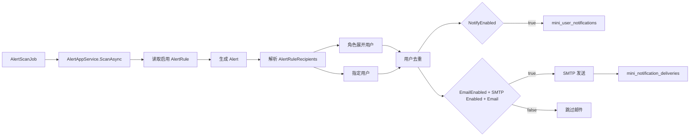

# 通知通道与接收人配置设计

## 背景

系统已经具备系统监控、告警中心、告警规则和站内通知中心。当前告警通知默认发给 `admin` 角色，无法按规则配置接收角色、指定用户，也没有系统外触达方式。企业级后台需要把“谁接收”和“通过什么方式接收”配置清楚，尤其是重要告警需要在用户不登录系统时也能触达。

## 目标

- 告警规则支持配置接收角色和指定用户。
- 告警规则支持控制站内信和邮件两个通道。
- 用户资料增加邮箱字段，作为邮件收件地址。
- 告警触发后按规则解析接收人，去重后创建站内信，并按配置发送邮件。
- 邮件发送使用 SMTP 配置，密钥不进入数据库。
- 记录邮件发送结果，便于排查发送失败。
- 保留 Webhook 通道扩展点，暂不实现企业微信、钉钉、飞书。

## 不做范围

- 不做短信。
- 不做企业微信、钉钉、飞书 Webhook 实际发送。
- 不做页面维护 SMTP 密码，避免明文密钥入库。
- 不做复杂模板编辑器。
- 不做部门、岗位接收人，第一版只支持角色和用户。
- 不做用户自主订阅和退订。

## 接收人模型

新增告警规则接收人表：

```text
mini_alert_rule_recipients
- Id
- AlertRuleId
- RecipientType: Role | User
- RecipientId
- CreatedAt
```

同一规则下 `(AlertRuleId, RecipientType, RecipientId)` 唯一。角色接收人按 `UserRole` 展开成用户，指定用户直接加入列表，最后按用户 ID 去重。

默认种子：5 条内置告警规则都配置 `admin` 角色为接收人，保持现有行为。

## 通道模型

沿用 `AlertRule.NotifyEnabled` 表示站内信开关，并新增：

```text
AlertRule.EmailEnabled
```

通道语义：

- 站内信：默认开启，可按规则关闭；写入 `mini_user_notifications`。
- 邮件：默认关闭或开启由种子决定，建议默认关闭；用户有邮箱且 SMTP 启用时才发送。
- Webhook：只预留字段和接口边界，不落实际实现。

## 用户邮箱

`User` 增加可选 `Email`：

```text
mini_users.Email varchar(256) null
```

用户新增、编辑、列表应携带邮箱。第一版不扩展用户导入导出格式，避免影响已有导入模板。用户没有邮箱、SMTP 未启用或 SMTP 配置不完整时，站内信正常发送，邮件发送记录统一写为 `Skipped`。

## 邮件发送

新增 SMTP 配置：

```json
{
  "Notification": {
    "Email": {
      "Enabled": false,
      "Host": "",
      "Port": 465,
      "UserName": "",
      "Password": "",
      "FromEmail": "",
      "FromName": "MiniAdmin",
      "EnableSsl": true
    }
  }
}
```

`Password` 只允许通过 `appsettings.Development.json` 或环境变量配置，不做页面保存。

新增邮件发送记录表：

```text
mini_notification_deliveries
- Id
- Channel: Email
- UserId
- RecipientAddress
- Title
- Content
- SourceType
- SourceId
- Status: Pending | Succeeded | Failed | Skipped
- ErrorMessage
- RetryCount
- CreatedAt
- SentAt
```

第一版在告警扫描后同步尝试发送邮件并记录结果；SMTP 失败只影响邮件发送记录，不影响告警扫描任务本身。后续可升级为 Outbox + 定时任务重试。

## 页面设计

在 `系统监控 / 告警规则` 编辑弹窗中增加“通知配置”区域：

- 站内信开关。
- 邮件开关。
- 接收角色多选。
- 指定用户多选。

角色和用户选择复用现有角色列表、用户列表接口。若用户没有 `system:alert-rule:update` 权限，只能查看不能编辑。

## 数据流



## 错误处理

- 接收人为空：回退到 `admin` 角色，避免关键告警无人接收。
- 邮件未配置：站内信不受影响，邮件发送记录标记为 `Skipped`。
- SMTP 失败：不影响告警创建和站内信；记录失败原因。
- 重复告警：站内信继续沿用现有唯一约束避免重复通知；邮件发送也应避免同一用户同一告警重复发送。

## 验收标准

- 管理员可以在告警规则编辑弹窗配置接收角色和指定用户。
- 告警触发后，角色用户和指定用户都能收到站内信。
- 同一用户同时来自角色和指定用户时只收到一条站内信。
- 规则关闭站内信后，不创建站内信。
- 规则开启邮件且用户有邮箱、SMTP 启用时，产生邮件发送记录并调用邮件发送服务。
- SMTP 失败不会影响告警扫描任务完成。
- 用户列表、新增、编辑支持邮箱字段。
- 后端测试和前端构建通过。
