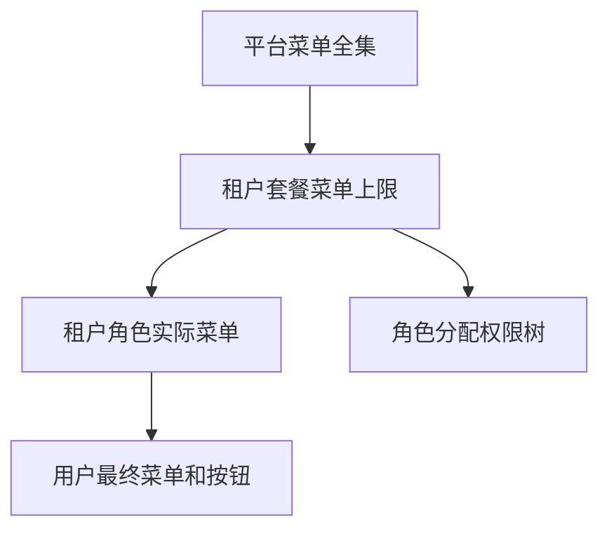

# 租户套餐菜单授权设计

## 背景

系统已经支持 SaaS 租户、租户登录、租户管理员和用户、角色、部门、岗位的数据隔离。下一步需要让平台能控制每个租户允许使用哪些菜单和按钮，避免租户通过历史角色权限继续访问套餐外功能。

## 目标

- 平台管理员可以维护租户套餐。
- 每个套餐可以绑定一组菜单和按钮权限。
- 租户绑定套餐后，租户用户的最终权限等于角色权限和套餐权限的交集。
- 租户管理员给角色分配权限时，只能看到和保存套餐允许的菜单。
- 平台收缩套餐权限时，自动清理使用该套餐的租户角色中超出套餐范围的权限。
- 平台用户不受套餐限制。

## 非目标

- 本阶段不实现计费、订单、套餐购买流程。
- 本阶段不实现套餐版本历史。
- 本阶段不实现租户自助升级套餐。
- 本阶段不处理每租户独立数据库。

## 权限链路

## 后端设计

- `TenantPackage.MenuIds` 继续作为 JSON 数组保存套餐授权菜单 ID。
- 新增套餐接口：列表、新增、编辑、启停、获取套餐菜单、保存套餐菜单、套餐选项。
- 租户创建和编辑请求增加 `PackageId`。
- 菜单仓储在计算租户用户授权菜单时取 `角色菜单 ∩ 套餐菜单`。
- 角色仓储在读取权限树和保存角色菜单时应用当前租户套餐上限。
- 保存套餐菜单时自动删除使用该套餐的租户角色中不在套餐内的 `RoleMenu`。
- 保存套餐菜单和调整租户套餐后，清理相关租户用户授权缓存。

## 前端设计

- 将现有 `系统管理 / 租户套餐` 占位页改为真实页面。
- 套餐页面提供查询、新增、编辑、启停、分配权限。
- 分配权限复用角色权限树的交互方式。
- 平台租户管理新增套餐列和套餐选择框。
- 新增租户时必须选择套餐，编辑租户时可以调整套餐。

## 验收标准

- 平台管理员可以创建套餐并勾选菜单权限。
- 租户绑定套餐后，租户用户只能看到套餐内且角色拥有的菜单。
- 租户管理员给角色分配权限时，看不到套餐外菜单。
- 平台收缩套餐权限后，租户角色中超出的 `RoleMenu` 自动清理。
- 后端测试覆盖套餐上限和自动清理。
