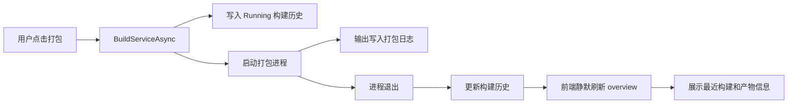

# 项目运行管理构建历史与产物管理设计

## 目标

把项目运行管理从“能打包”补全为“能追踪打包结果、能找到打包产物”。这为后续工作流编排提供基础数据。

## 设计

构建历史仍采用本地 JSON 存储，位置为 `data/project-runtime/build-history.json`，与项目运行配置保持同一工具边界。每次打包启动时写入 `Running` 记录；进程退出时更新同一条记录，补齐结束时间、耗时、退出码和最终状态。

服务配置增加 `buildArtifactPath`。后端在返回 overview 时读取该路径，计算产物是否存在、类型、大小、更新时间，并附带最近一次构建记录。前端在服务操作区和日志控制台中展示这些信息。

## 数据流

## 风险控制

- 历史记录最多保留最近 100 条，避免本地文件无限增长。
- 产物路径限制在工作区目录内，避免读取任意路径。
- 打包状态和运行状态继续分离，打包不会影响服务运行状态。
